# Lava & Water - курсовая работа по ООП

Игра «Лава и вода» — это пошаговая головоломка с лабиринтоподобным геймплеем. 
Ваша задача состоит в том, чтобы как можно быстрее добраться до выхода, не касаясь стремительно расползающейся лавы.

## Диаграмма классов вычислительной модели
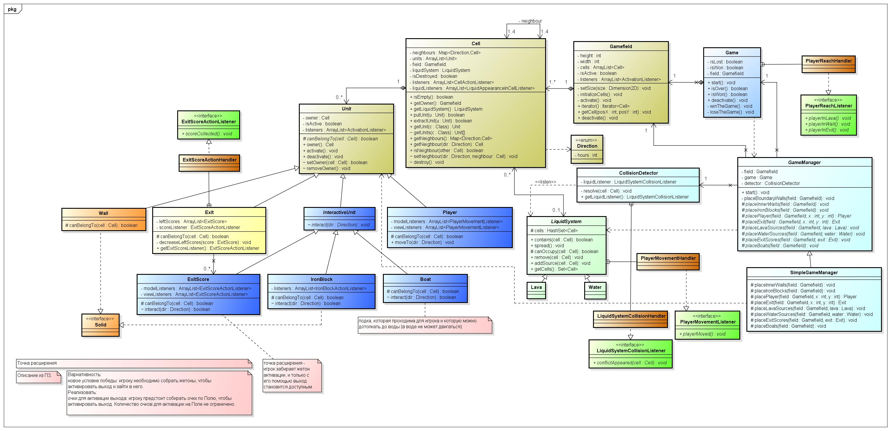

## Диаграмма классов представления
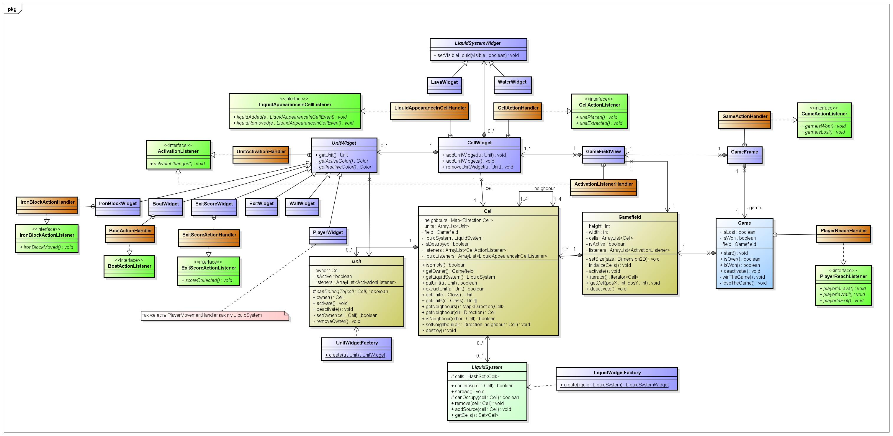

## Диаграммы последовательностей

### Главный игровой процесс - победа игрока
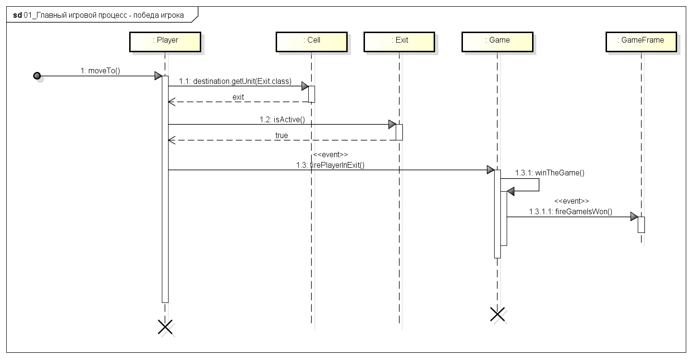

### Фабрика устанавливает блок железа
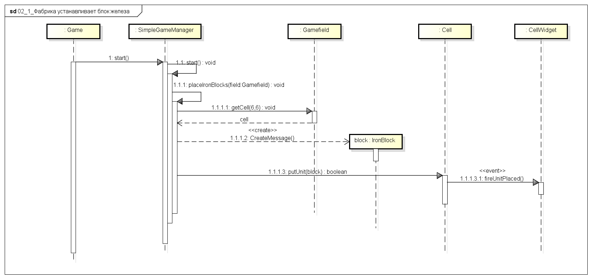

### Фабрика устанавливает источник лавы
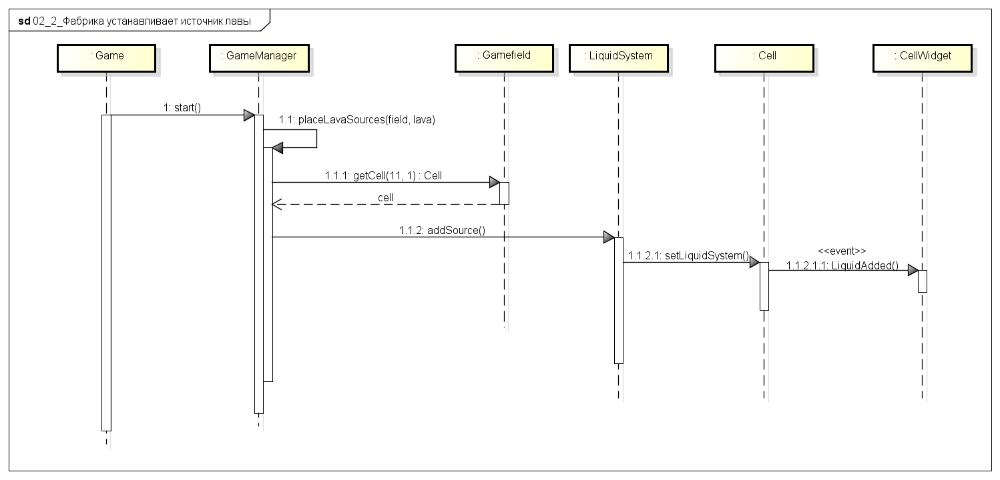

### Игрок толкает блок железа - успех
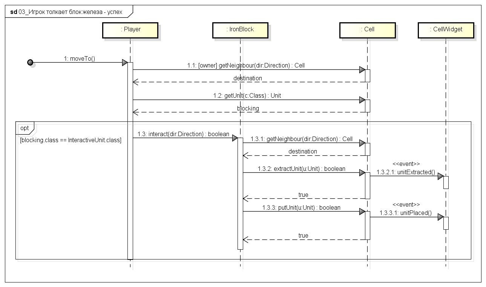

### Растекание жидкости по полю на примере лавы
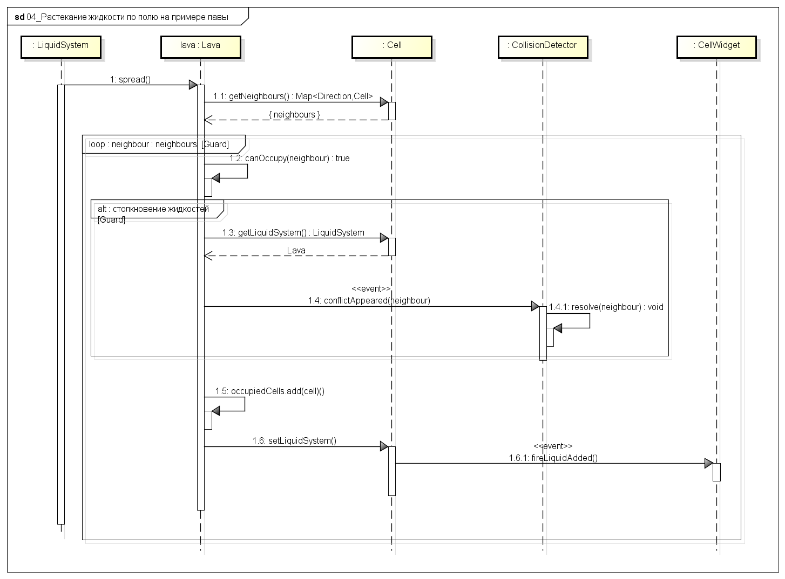

### Игрок умирает от лавы
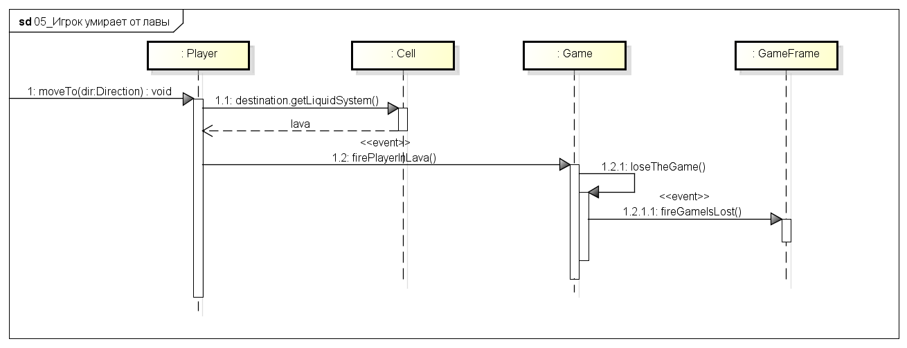

### Детектор разрешает конфликты с жидкостями
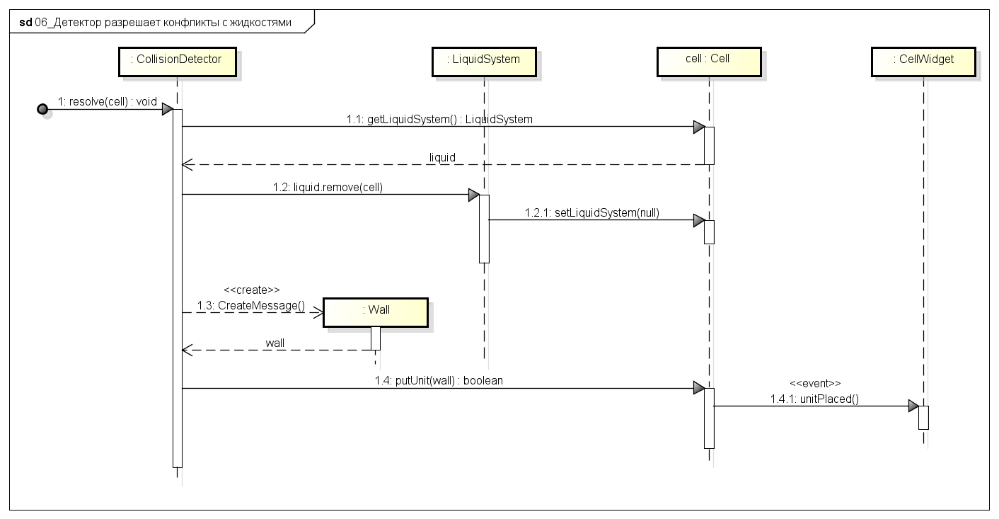

### Создание юнит-виджетов на примере стены
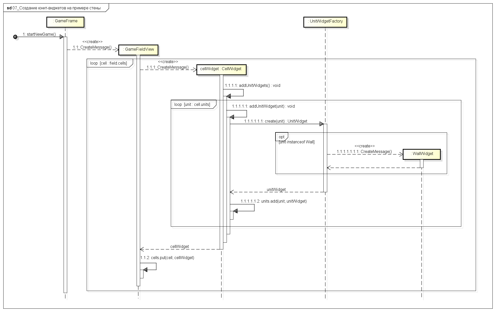

### Игрок подбирает жетон активации выхода
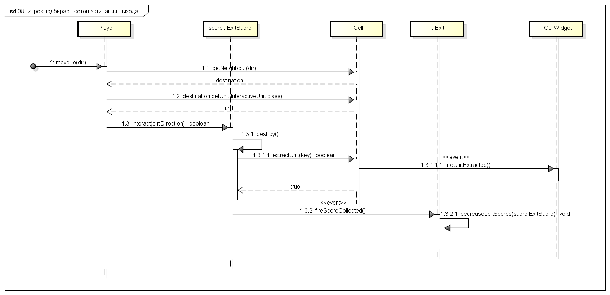

### Лодка не двигается из-за воды
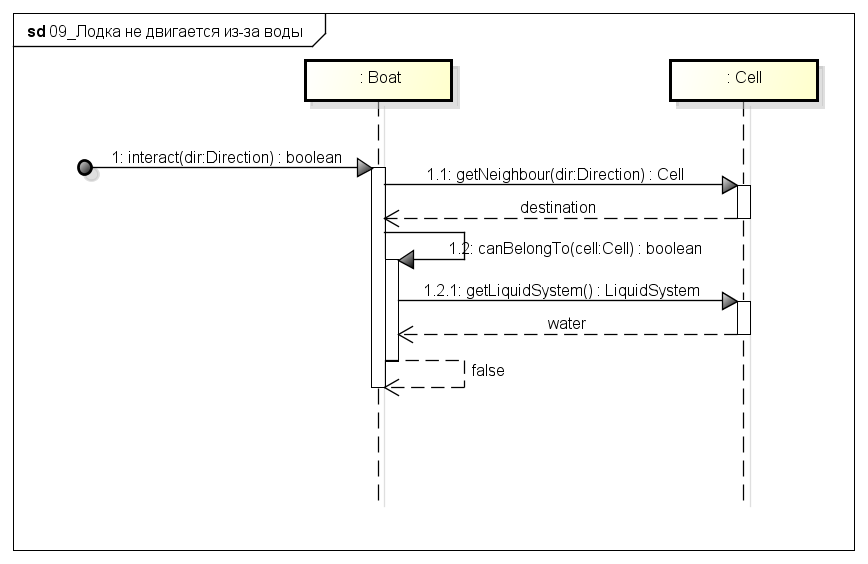
